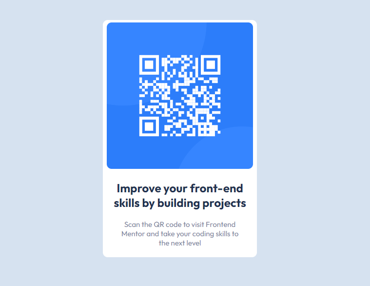

# Frontend Mentor - QR code component solution

This is a solution to the [QR code component challenge on Frontend Mentor](https://www.frontendmentor.io/challenges/qr-code-component-iux_sIO_H). Frontend Mentor challenges help you improve your coding skills by building realistic projects. 

## Table of contents

- [Overview](#overview)
  - [Screenshot](#screenshot)
  - [Links](#links)
- [My process](#my-process)
- [Author](#author)

## Overview

I've been doing this work just to remind me of some studies i'm working on. It was nice to do this job, although I had problem to align the DIV, and that's why it's good to remember the basics.

### Screenshot

### Links

- Solution URL: [Add solution URL here](https://your-solution-url.com)
- Live Site URL: [Add live site URL here](https://your-live-site-url.com)

## My process

    It wasn't hard to put all together, i had problems to align the main DIV, because I'm still learning about positions using CSS. 
    This project was totally about CSS.

## Author

- Frontend Mentor - [@mmdros](https://www.frontendmentor.io/profile/mmdros)
